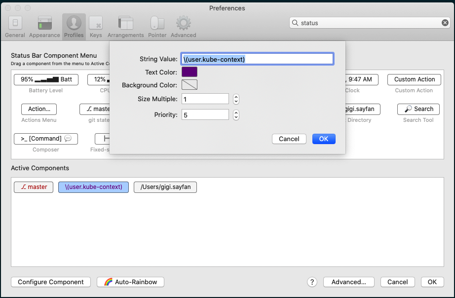

# Overview

This repository contains Gigi's dotfiles and other shell-y stuff.
The foundation is zsh on MacOS. There's no attempt to make it universal.
The README file introduces the general approach for organizing this stuff
and then explains how to install it, how to use the existing functionality
and how to extend it.

I took some stuff from https://github.com/holman/dotfiles (some of the macOS defaults)

## Introduction

The goal is to have a zero to hero one-click setup that can be extended for specific purposes (e.g. work stuff) without touching the base. 

## Installation

Make sure git is installed:

```
$ git version
git version 2.25.0
```

Then, clone the repository and run the setup script:

```
mkdir ~/git
cd ~/git
git clone https://github.com/the-gigi/dotfiles.git
cd dotfiles
. ./setup.sh
```

## Usage

The built-in functionality includes:

- Installing various tools
- Symlinking various rc files to the home dir
- Adding various tools and directories to the PATH
- Various functions
- Various aliases

You should check out the various files in the `bootstrap` and `components` directory. 

### First-time setup

The setup.sh script performs the following:

- 

### Shell and profile setup


## Components

### docker


### general

### git

### iterm2

The iterm2 contains 3 functions:

- set_iterm2_title
- set_iterm2_tab
- iterm2_print_user_vars

The first two functions do what you think they do.

The `iterm2_print_user_vars()` function defines a `user.kube-context` variable that 
can be used as an interpolated string in the status bar to always 
show the current kube context (super useful). 

First you must install the iTerm2 shell integration, by clicking on `iTerm2 > Install Shell Integration`


Then make sure to enable the status bar and click `Configure status bar`:


Now, you can add an "Interpolated String component" to the active components. Set its value to `\(user.kube-context)`, which is the user variable defined by the `iterm2_print_user_vars()` function. I recommend setting the text color to pueple to match the color of the ☸️ [wheel of dharma](https://emojipedia.org/wheel-of-dharma/) symbol.



Here is the end result:


### k8s

### navigation

### ssh

If the company uses Github you'll need to have multiple Github hosts in the ~/.ssh/config file

See https://gist.github.com/oanhnn/80a89405ab9023894df7 how to have personal and work
Github entries. 

At the moment the ~/.ssh/config is re-generated every time from [here](components/ssh.sh)

This means you'll need to modify this file and add a work host

TODO: make it extensible, by allowing to add entries


### prompt

The setup uses [powerlevel10k](https://github.com/romkatv/powerlevel10k) for a feature-rich zsh prompt. It includes:

- **Directory emojis**: Different directories show custom emojis
  - 🏠 Home directory (`~`)
  - 🐙 Git directories (`~/git/*`)
- **Git status**: Shows branch, staged/unstaged changes, and commit status
- **Time display**: Current time in the top-right corner
- **Two-line prompt**: Clean separation between info and command input

To customize the prompt appearance, run `p10k configure`. The configuration is stored in `~/.p10k.zsh` and can be version-controlled as part of your dotfiles.

**Font Setup**: The setup automatically installs MesloLG Nerd Font. After installation, set your terminal font to see all icons properly:

1. **iTerm2**: Go to `iTerm2 → Settings → Profiles → Text → Font`
2. Click "Change Font" and select "MesloLGLDZ Nerd Font" or "MesloLGLDZ Nerd Font Mono"
3. **Other terminals**: Look for font/appearance settings and choose a MesloLG Nerd Font variant

If you see question marks (❓) in your prompt, your terminal font doesn't support the required symbols.

For local customizations (like work-specific directory mappings), add overrides to `~/.dotfiles.local/p10k-local.sh`.

## Extensions and customizations

Customization is done by running commands before and after the main .zshrc script, as well as dropping files in various directories that will be picked up and executed (sourced) by the main script.

To maintain order (in case it's important) files may have a double digit numeric prefix starting at 10 so it's possible to add files in a certain execution order.
